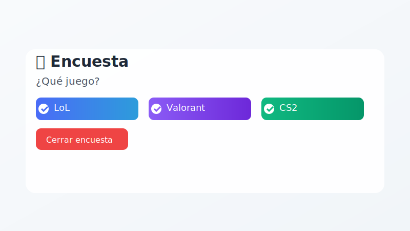
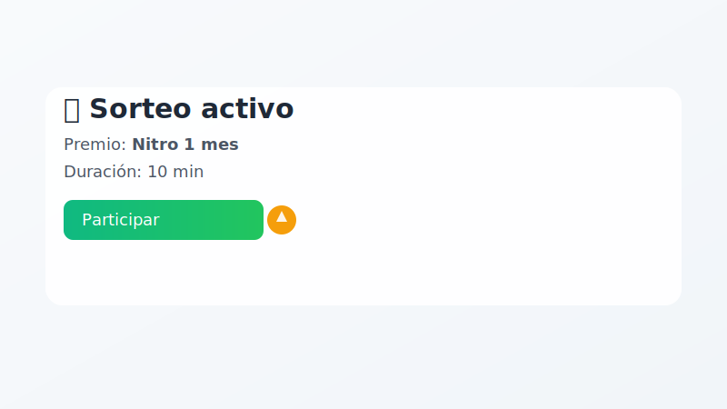
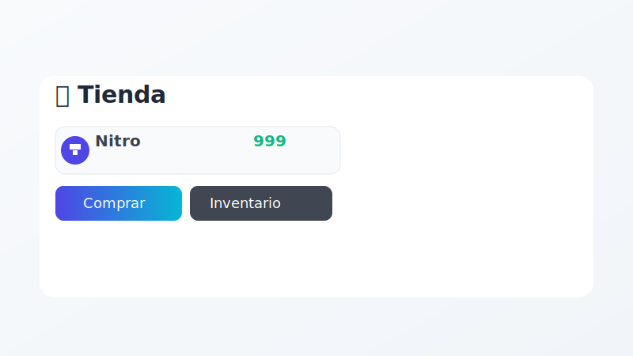
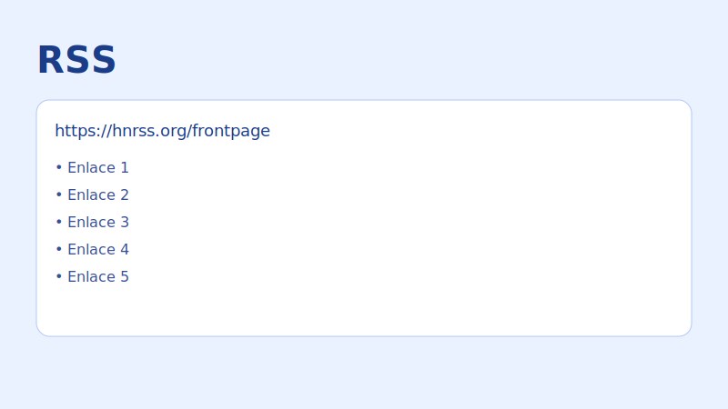
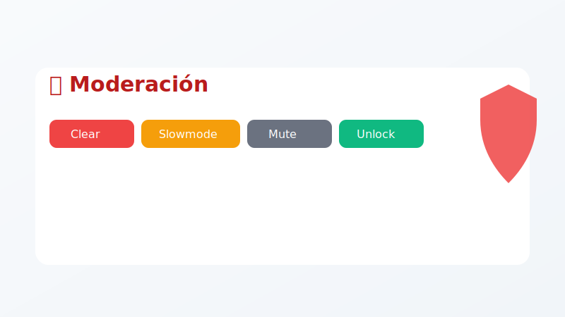
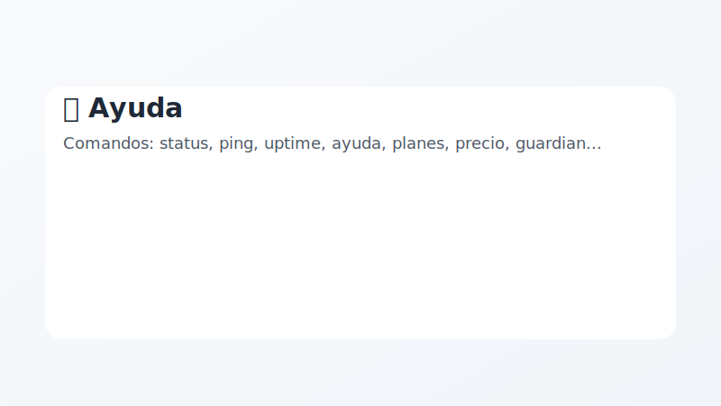
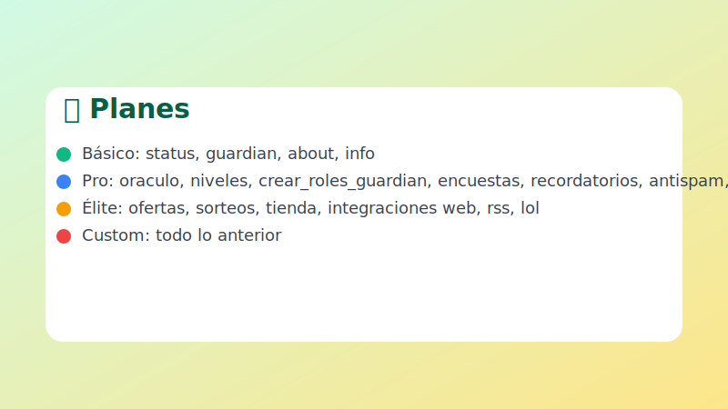

# PoseidonUI — Bot de Discord listo para servidores gaming y comunidad

[](https://github.com/Luciuss04/PoseidonUI/actions/workflows/ci.yml)


## Valor
- Automatiza soporte con canales de Oráculo y cierre guiado.
- Verificación con botón y roles temporales rituales.
- Sistema de niveles y rangos temáticos por actividad.
- Integración LoL: datos de invocador y clasificatoria.
- Threads diarios con 30+ ofertas destacadas de juegos.
- Panel de estado del bot y salud del sistema.

## Características
- `⚡ Oráculo` — panel de ayuda con apertura/cierre de canales.
- `🛡 Guardian` — verificación con botón y Juicio Divino con roles temporales.
- `🌟 Niveles` — XP por mensajes y rangos míticos.
- `🏷 Ofertas` — thread diario con ofertas (CheapShark).
- `📊 Status/Tools` — `/status`, `/ping`, `/uptime`, `/comandos`.
- `ℹ️ Info` — `/botinfo`, `/demo`, `/ayuda`, `/planes`, `/precio`.
- `🧠 Comunidad` — encuestas (`/encuesta`), recordatorios (`/recordatorio`), utilidades (`/sugerencia`, `/anuncio`, `/evento`, `tags`, canales temporales).
- `💰 Economía` — monedas (`/balance`, `/daily`, `/work`, `/dar`, `/quitar`, `/top`), sorteos (`/sorteo`).
- `🛍 Tienda` — `/tienda_add`, `/tienda_list`, `/comprar`, `/inventario`, `/regalar`, `/tienda_clear`.
- `🧰 Moderación` — anti‑spam automático, `/clear`, `/slowmode`, `/mute`, `/unmute`, `/lock`, `/unlock`, `/warn`.
- `🌐 Integraciones` — LoL (`RIOT_API_KEY`), web (`/wiki`, `/crypto`, `/hn`, `/quote`, `/ip`, `/cat`, `/dog`), RSS (`/rss`).

## Requisitos
- Python 3.11+
- Dependencias: ver `requirements.txt`.
- Permisos de Intents: `message_content`, `guilds`, `members`.

## Instalación rápida
1. Clona el repo.
2. Entra a `BotDiscord4.0/` y ejecuta `start.bat` (Windows) para crear `venv` e instalar dependencias.
3. Copia `.env.example` a `.env` y completa:
   - `DISCORD_TOKEN`
   - `RIOT_API_KEY` (opcional, para LoL)
   - `CANAL_OFERTAS_ID` (opcional, para publicaciones diarias)
   - `LICENSE_KEY` (tu clave de licencia)
   - `LICENSES_PATH` (ruta privada local de licencias, p.ej. `C:\\PoseidonLicenses`)
   - `LICENSE_SIGNING_SECRET` (secreto para firmar licencias HMAC)
   - `ALLOW_PLAIN_LICENSES=0/1` (recomendado `0`)
4. Arranca el bot: `python main.py` o `start.bat`.

## Comandos
- Prefijo `!`:
  - `!oferta`, `!ofertas` — embeds de ofertas.
- Slash `/`:
  - `/botinfo` — ficha del bot.
  - `/demo` — tarjetas de presentación en un thread.
  - `/status` — panel de estado (admins/staff).
  - `/juicio` — rol temporal ritual.
  - `/crear_roles_guardian` — crea roles del Guardian.
  - `/ofertas` — 30+ ofertas en thread.

## Configuración
- Intents: habilita `Message Content Intent` en el portal de Discord Developer.
- Roles/canales: ajusta nombres en `guardian.py` y `config.py` si tu servidor usa otros nombres.
- Publicación de ofertas: define `CANAL_OFERTAS_ID` para el canal donde se crean threads diarios.
- Licencias: el bot valida `LICENSE_KEY` contra `licenses_plans.txt` en `LICENSES_PATH`.
  - Formato soportado: `KEY|PLAN|SIG` donde `SIG=HMAC_SHA256_base64url(KEY|PLAN)`.
  - Planes: `basic`, `pro`, `elite`, `custom`.
  - Con `ALLOW_PLAIN_LICENSES=0`, solo se aceptan claves firmadas.

## Seguridad
- No subas `.env`. Está ignorado por `.gitignore`.
- No subas licencias; usa `LICENSES_PATH` privado fuera del repo.
- Datos generados (`niveles.json`, `oraculos.json`) están ignorados.

## Calidad
- Tests: `python -m unittest discover -s BotDiscord4.0/tests -v`.
- CI: compilación y tests automáticos en cada push.

## Demo rápida
- Ejecuta `/botinfo` y `/demo` en un canal; verás tarjetas con cada módulo y el banner, ideal para enseñar el producto.

## Ejemplos de uso
- Encuestas: `/encuesta "¿Qué juego?" "LoL;Valorant;CS2"` y cierra con el botón para ver resultados.
- Sorteos: `/sorteo "Nitro 1 mes" 10` y los usuarios se apuntan con el botón.
- Tienda: `/tienda_add "Nitro" 999`, `/tienda_list`, `/comprar "Nitro"`, `/inventario`.
- RSS: `/rss "https://hnrss.org/frontpage"` muestra los últimos 5 enlaces.
- Recordatorios: `/recordatorio 30 "Reunión"` envía un DM en 30 min.
- Moderación: `/clear 50`, `/slowmode 10`, `/mute @usuario 15`, `/unlock`.
- Integraciones web: `/wiki python`, `/crypto bitcoin`, `/hn`, `/quote`, `/ip 8.8.8.8`.
- Diagnóstico: `/ping`, `/uptime`, `/comandos`.
- Info: `/ayuda`, `/planes`, `/precio`.

### Mini demo — Ayuda y Planes
```text
/ayuda
🧾 Comandos: status, ping, uptime, ayuda, planes, precio, guardian, juicio, crear_roles_guardian, oraculo, niveles, encuestas, recordatorios, utilidades, monedas, sorteos, tienda, rss, web, lol...

/planes
Básico: status, guardian, about, info
Pro: oraculo, niveles, crear_roles_guardian, encuestas, recordatorios, antispam, herramientas, monedas
Élite: ofertas, sorteos, tienda, integraciones web, rss, lol
Custom: todo lo anterior
```

## Galería
> Sustituye las rutas por tus capturas/GIFs una vez subidas.
- Encuestas: 
- Sorteos: 
- Tienda: 
- RSS: 
- Moderación: 
- Ayuda: 
- Planes: 

> Variantes oscuras disponibles: `assets/*_dark.svg`

### Cómo añadir media
- Crea carpeta `assets/` en la raíz del repo y sube tus imágenes/GIFs.
- Nombres sugeridos: `encuesta.svg`, `sorteo.svg`, `tienda.svg`, `rss.svg`, `moderacion.svg`.
- También: `ayuda.svg`, `planes.svg`.
- Los enlaces del README apuntan a esa carpeta; al hacer push se mostrarán automáticamente.

## Soporte
- Contáctanos para personalización: branding, features extra, integraciones.

## Precios
- Básico — 19€: instalación, `status/tools`, `guardian`, `about`, `info`.
- Pro — 39€: incluye Básico + `oráculo`, `niveles`, `crear_roles_guardian`, `encuestas`, `recordatorios`, `antispam`, `herramientas`, `monedas`.
- Élite — 69€: incluye Pro + `ofertas`, `sorteos`, `tienda`, `integraciones web`, `RSS`, `LoL` (requiere `RIOT_API_KEY`).
- Personalizado — desde 99€: branding, nuevas features, integraciones específicas.

Contacta por Issues o discord para cerrar compra y entrega.

## Planes
| Plan | Incluye | Ideal para |
| --- | --- | --- |
| Básico (19€) | Botinfo, Demo, Status, Guardian, instalación | Servidores pequeños |
| Pro (39€) | Básico + Oráculo, Niveles, ajuste de roles/canales | Comunidad activa |
| Élite (69€) | Pro + Ofertas diarias, LoL (RIOT_API_KEY) | Gaming / eSports |
| Personalizado (99€+) | Branding, nuevas features, integraciones | Marca propia |

[Comprar / Solicitar](https://github.com/Luciuss04/PoseidonUI/issues/new?title=Compra%20PoseidonUI&body=Plan:%20B%C3%A1sico/Pro/%C3%89lite/Personalizado)

## FAQ
- ¿Necesito habilitar intents? Sí: `message_content`, `guilds`, `members`.
- ¿Se sube `.env`? No, está ignorado. Usa `.env.example` como guía.
- ¿Cómo activo ofertas diarias? Define `CANAL_OFERTAS_ID` con el ID del canal.
- ¿Qué necesito para LoL? `RIOT_API_KEY` válido en `.env`.
- ¿Dónde veo una demo? Ejecuta `/botinfo` y `/demo` en tu servidor.
