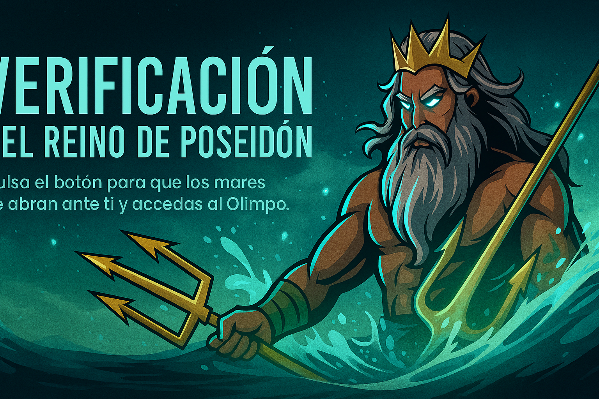

# PoseidonUI — Bot de Discord listo para servidores gaming y comunidad

## Valor
- Automatiza soporte con canales de Oráculo y cierre guiado.
- Verificación con botón y roles temporales rituales.
- Sistema de niveles y rangos temáticos por actividad.
- Integración LoL: datos de invocador y clasificatoria.
- Threads diarios con 30+ ofertas destacadas de juegos.
- Panel de estado del bot y salud del sistema.

## Características
- `⚡ Oráculo` — panel de ayuda con apertura/cierre de canales.
- `🛡 Guardian` — verificación con botón y Juicio Divino con roles temporales.
- `🌟 Niveles` — XP por mensajes y rangos míticos.
- `🏆 LoL` — `/invocador`, `/ranked` via Riot API.
- `🏷 Ofertas` — thread diario con ofertas (CheapShark).
- `📊 Status` — `/status` para admins/staff.
- `ℹ️ Botinfo` — `/botinfo` y `/demo` para mostrar el producto.

## Requisitos
- Python 3.11+
- Dependencias: ver `requirements.txt`.
- Permisos de Intents: `message_content`, `guilds`, `members`.

## Instalación rápida
1. Clona el repo.
2. Entra a `BotDiscord4.0/` y ejecuta `start.bat` (Windows) para crear `venv` e instalar dependencias.
3. Copia `.env.example` a `.env` y completa:
   - `DISCORD_TOKEN`
   - `RIOT_API_KEY` (opcional, para LoL)
   - `CANAL_OFERTAS_ID` (opcional, para publicaciones diarias)
4. Arranca el bot: `python main.py` o `start.bat`.

## Comandos
- Prefijo `!`:
  - `!oferta`, `!ofertas` — embeds de ofertas.
- Slash `/`:
  - `/botinfo` — ficha del bot.
  - `/demo` — tarjetas de presentación en un thread.
  - `/status` — panel de estado (admins/staff).
  - `/juicio` — rol temporal ritual.
  - `/crear_roles_guardian` — crea roles del Guardian.
  - `/ofertas` — 30+ ofertas en thread.

## Configuración
- Intents: habilita `Message Content Intent` en el portal de Discord Developer.
- Roles/canales: ajusta nombres en `guardian.py` y `config.py` si tu servidor usa otros nombres.
- Publicación de ofertas: define `CANAL_OFERTAS_ID` para el canal donde se crean threads diarios.

## Seguridad
- No subas `.env`. Está ignorado por `.gitignore`.
- Datos generados (`niveles.json`, `oraculos.json`) están ignorados.

## Calidad
- Tests: `python -m unittest discover -s BotDiscord4.0/tests -v`.
- CI: compilación y tests automáticos en cada push.

## Demo rápida
- Ejecuta `/botinfo` y `/demo` en un canal; verás tarjetas con cada módulo y el banner, ideal para enseñar el producto.

## Soporte
- Contáctanos para personalización: branding, features extra, integraciones.

## Precios
- Básico — 19€: instalación, `/botinfo`, `/demo`, módulos `status` y `guardian`.
- Pro — 39€: incluye Básico + `oráculo`, `niveles`, configuración de roles/canales.
- Élite — 69€: incluye Pro + `ofertas` diarias y módulos LoL (requiere `RIOT_API_KEY`).
- Personalizado — desde 99€: branding, nuevas features, integraciones específicas.

Contacta por Issues o discord para cerrar compra y entrega.

## Planes
| Plan | Incluye | Ideal para |
| --- | --- | --- |
| Básico (19€) | Botinfo, Demo, Status, Guardian, instalación | Servidores pequeños |
| Pro (39€) | Básico + Oráculo, Niveles, ajuste de roles/canales | Comunidad activa |
| Élite (69€) | Pro + Ofertas diarias, LoL (RIOT_API_KEY) | Gaming / eSports |
| Personalizado (99€+) | Branding, nuevas features, integraciones | Marca propia |

[Comprar / Solicitar](https://github.com/Luciuss04/PoseidonUI/issues/new?title=Compra%20PoseidonUI&body=Plan:%20B%C3%A1sico/Pro/%C3%89lite/Personalizado)

## FAQ
- ¿Necesito habilitar intents? Sí: `message_content`, `guilds`, `members`.
- ¿Se sube `.env`? No, está ignorado. Usa `.env.example` como guía.
- ¿Cómo activo ofertas diarias? Define `CANAL_OFERTAS_ID` con el ID del canal.
- ¿Qué necesito para LoL? `RIOT_API_KEY` válido en `.env`.
- ¿Dónde veo una demo? Ejecuta `/botinfo` y `/demo` en tu servidor.
