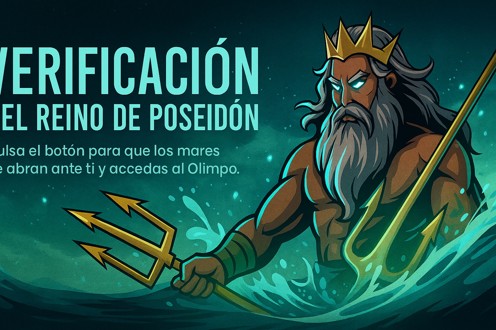

# 🔱 PoseidonUI — Gestión de Élite para Comunidades de Discord (v4.2)

[](https://github.com/Luciuss04/PoseidonUI/actions/workflows/ci.yml)
[](https://luciuss04.github.io/PoseidonUI/)
[](https://discord.gg/Kaf728xRFA)
[](https://www.python.org/)



**PoseidonUI** es la solución definitiva para servidores de Discord en 2026. Combina una gestión profesional mediante un **Dashboard Web** exclusivo, inteligencia artificial avanzada (**IA de Atenea**) y entretenimiento de alto nivel con un sistema de **Mascotas y Coliseo** totalmente interactivo.

🔗 **[Explorar Panel de Control](https://luciuss04.github.io/PoseidonUI/admin.html)** | **[Documentación Oficial](https://luciuss04.github.io/PoseidonUI/)**

---

## 🚀 Novedades Destacadas (Actualización Marzo 2026)

### 🖥️ Dashboard Administrativo Web
- **Control Remoto:** Gestiona canales de logs, roles de staff y temas visuales desde tu navegador.
- **Estadísticas en Tiempo Real:** Monitoriza el ping, uptime y actividad de los servidores.
- **Visor de Logs:** Accede a los registros detallados de cada servidor de forma centralizada.
- **Seguridad SHA-256:** Sistema de autenticación robusto con protección contra ataques de fuerza bruta.

### 🦉 IA de Atenea (Tickets Inteligentes)
- **Análisis de Intenciones:** La IA analiza el contenido de los tickets para sugerir la categoría adecuada.
- **Auto-Urgencia:** Detección automática de palabras clave críticas para marcar tickets como prioritarios.
- **Respuestas Divinas:** Bienvenida inteligente y personalizada según el problema detectado.

### 🏟️ El Coliseo de Mascotas v4.2
- **Interfaz RPG:** Barras de vida dinámicas y diseño visual estilo Coliseo.
- **Habilidades Únicas:** Cada especie cuenta con ataques especiales (Ej: *Aliento de Fuego*, *Descarga Voltáica*).
- **Críticos Divinos:** Sistema de combate aleatorio con bonificadores por elementos y golpes críticos.

---

## 🛠️ Características Core

- **💰 Economía Pro:** Bolsa de valores dinámica, trabajos con niveles y casino completo.
- **🛡️ Seguridad Avanzada:** Sistema Guardian (Captcha), AutoMod inteligente y soporte para protocolo DAVE (Voice E2EE).
- **🎵 Música Studio:** Filtros de audio (8D, Bassboost, Nightcore) y búsqueda ultra-rápida.
- **🏛️ Social & Rol:** Sistema de Clanes (Olimpos), Matrimonios, Confesiones y Niveles con rangos mitológicos.

---

## 💎 Planes y Licencias

| Plan | Incluye | Ideal para |
| :--- | :--- | :--- |
| **Básico** | Moderación, Música, Minijuegos, Guardian | Servidores pequeños |
| **Pro** | Todo Básico + Niveles, Economía, Oráculo, Confesiones | Comunidades activas |
| **Élite** | Todo Pro + Mascotas v4.2, Dashboard Web, IA Atenea | Gaming / eSports |

---

## ⚙️ Instalación y Configuración

### Requisitos
- Python 3.11+
- FFmpeg (Instalado en el PATH)
- Puerto `11111` abierto (Para el Dashboard Web)

### Guía Rápida
1. **Clonar y Entrar:**
   ```bash
   git clone https://github.com/Luciuss04/PoseidonUI.git
   cd PoseidonUI/BotDiscord4.0
   ```
2. **Entorno:**
   Configura el archivo `.env` basándote en `.env.example`.
3. **Dependencias:**
   ```bash
   pip install -r requirements.txt
   ```
4. **Ejecutar:**
   ```bash
   python app.py
   ```

### 🔒 Seguridad Importante
- El archivo `admin_keygen.py` **NO** debe subirse al repositorio (ya incluido en `.gitignore`).
- Asegúrate de configurar `LICENSE_SIGNING_SECRET` para proteger la integridad de tus licencias.
- El Dashboard requiere que el navegador permita "Contenido no seguro" si no se utiliza un certificado SSL en el host.

---

## 📂 Estructura de Carpetas

- `/bot/cogs`: Módulos de comandos organizados por categorías (Economía, Juegos, Moderación, etc.).
- `/docs`: Frontend del Dashboard y Landing Page (Servido por GitHub Pages).
- `app.py`: Punto de entrada principal optimizado para Teramont/Pterodactyl.
- `guild_config.json`: Persistencia de configuraciones personalizadas por servidor.

---

## 🤝 Soporte

- **Discord:** [Únete al Soporte](https://discord.gg/Kaf728xRFA)
- **Web:** [luciuss04.github.io/PoseidonUI](https://luciuss04.github.io/PoseidonUI/)
- **Email:** luciuss0444@gmail.com

© 2026 PoseidonUI. Todos los derechos reservados.
